# AIVideoDiagrams

Fourteen diagram types, one design system, for AI video production.

Every client delivery from madebysaira comes with a diagram. This is how
that happens without the diagrams looking like they were made by three
different people.

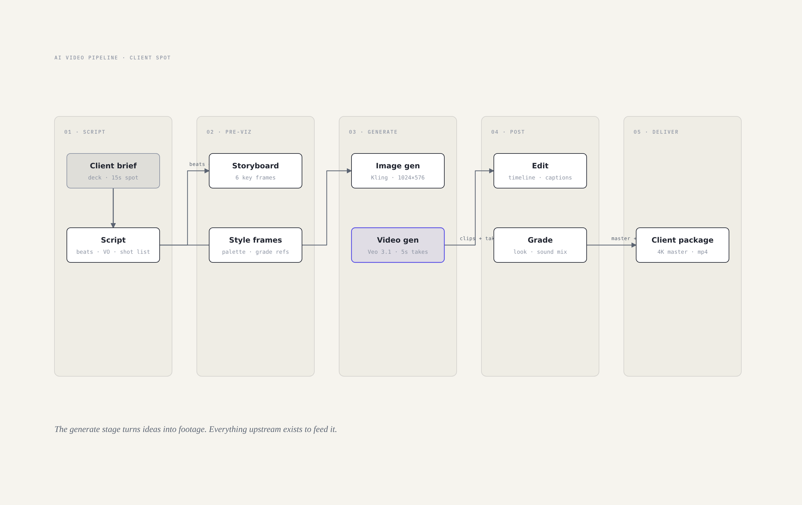

Diagrams are the cheapest client relationship tool I own. A pipeline
drawing settles more arguments in one meeting than a week of email. This
repo is the system behind those drawings: plain SVG files that open by
double-click, styled by CSS variables, generated light and dark, and
reviewed by a gate that checks the things a tired human forgets.

## The 14 types

| Type | For when the client needs to see… | Example |
|---|---|---|
| [Pipeline](skills/ai-video-diagrams/assets/example-pipeline.html) | how the work flows, stage to stage |  |
| [Decision tree](skills/ai-video-diagrams/assets/example-decision-tree.html) | which model or route to pick | 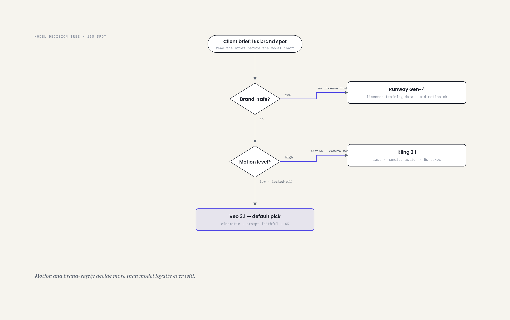 |
| [Character sheet](skills/ai-video-diagrams/assets/example-character-sheet.html) | who the character is, locked down | 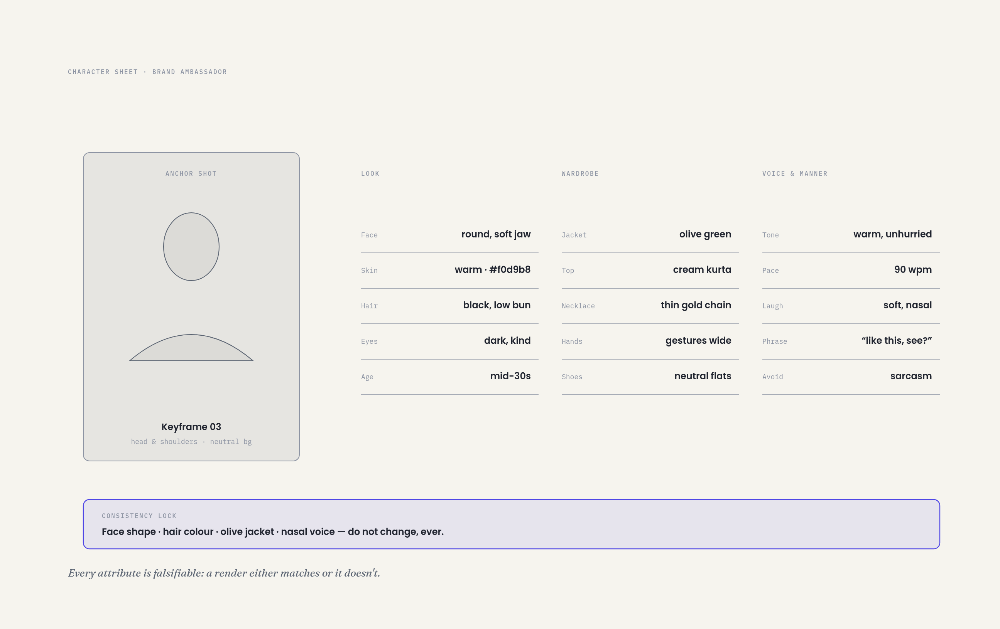 |
| [Style board](skills/ai-video-diagrams/assets/example-style-board.html) | what the footage should feel like | 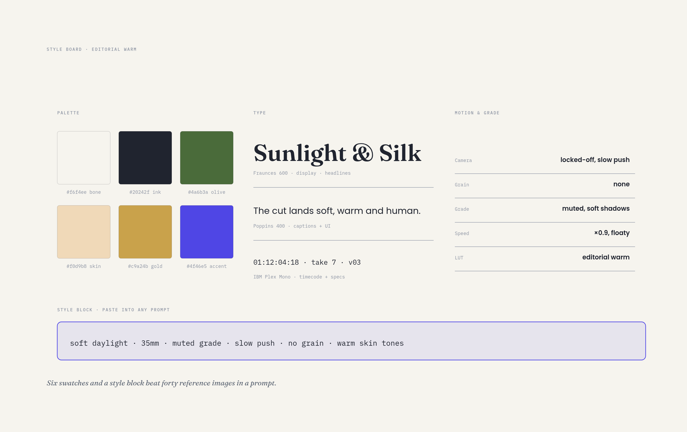 |
| [Swimlane](skills/ai-video-diagrams/assets/example-swimlane.html) | who does what, across roles | 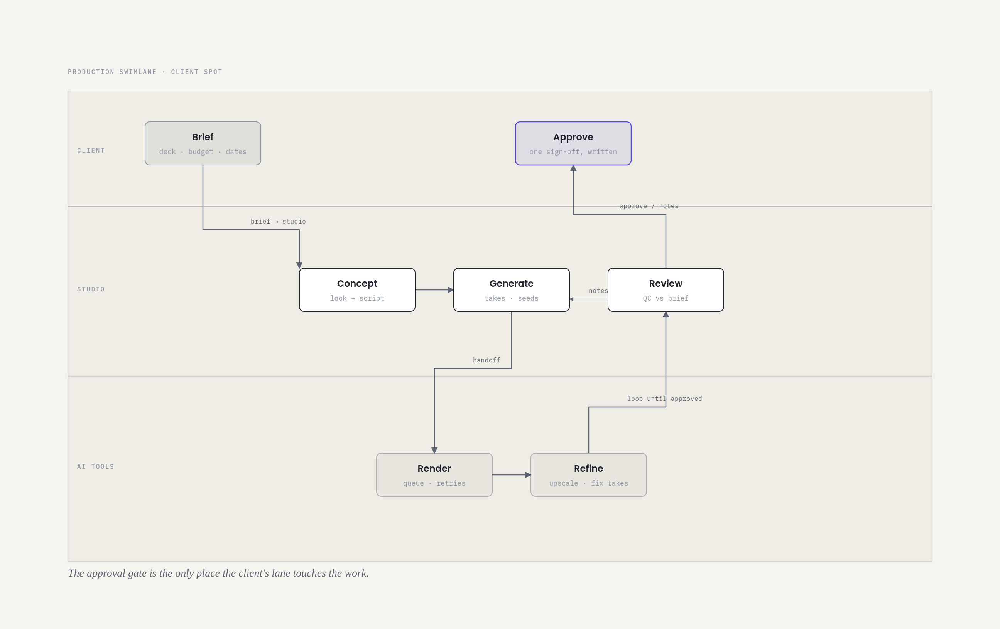 |
| [Sequence](skills/ai-video-diagrams/assets/example-sequence.html) | how the systems talk | 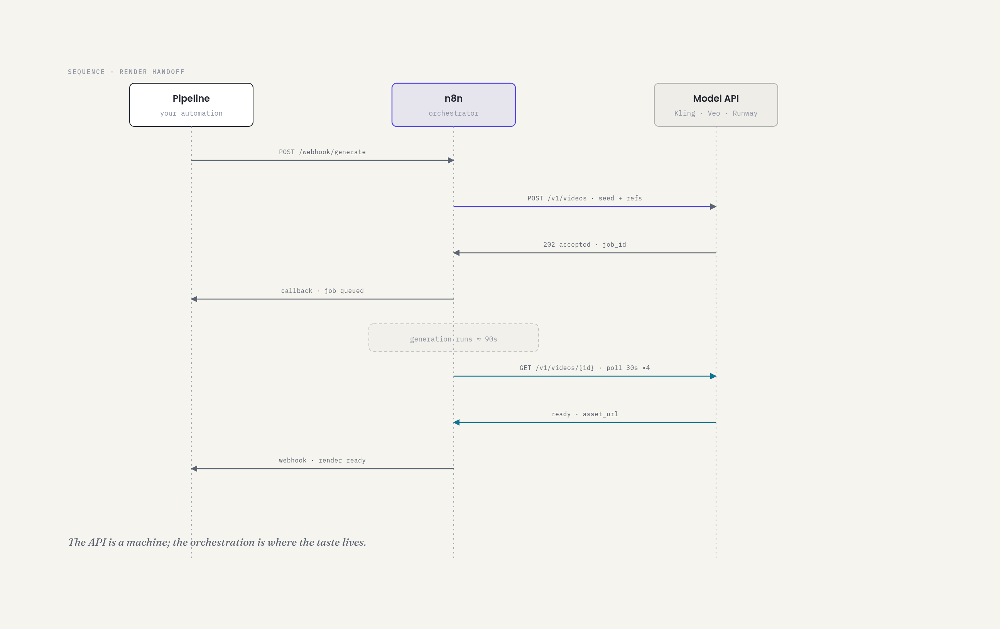 |
| [Quadrant](skills/ai-video-diagrams/assets/example-quadrant.html) | where tools sit on price and quality | 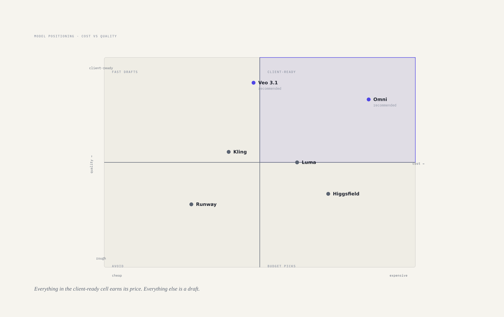 |
| [Layers](skills/ai-video-diagrams/assets/example-layers.html) | what sits on top of what | 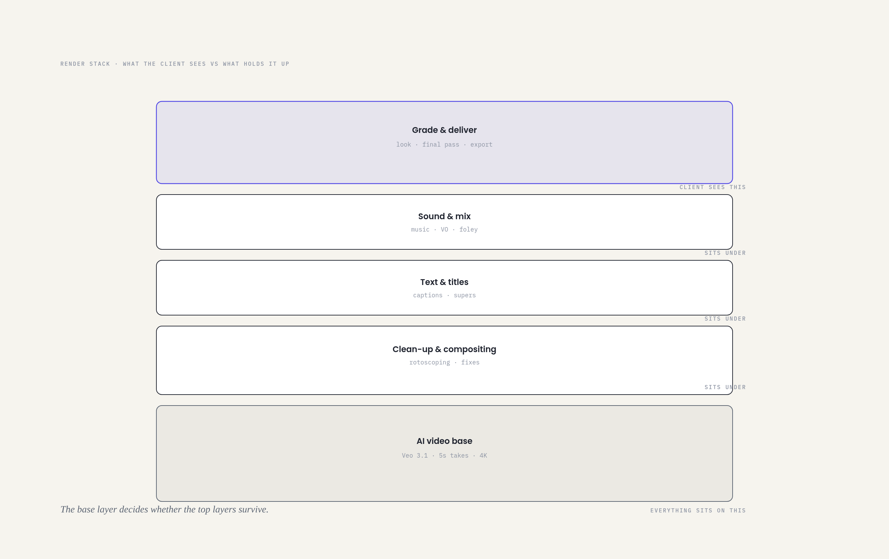 |
| [State](skills/ai-video-diagrams/assets/example-state.html) | what a render job goes through | 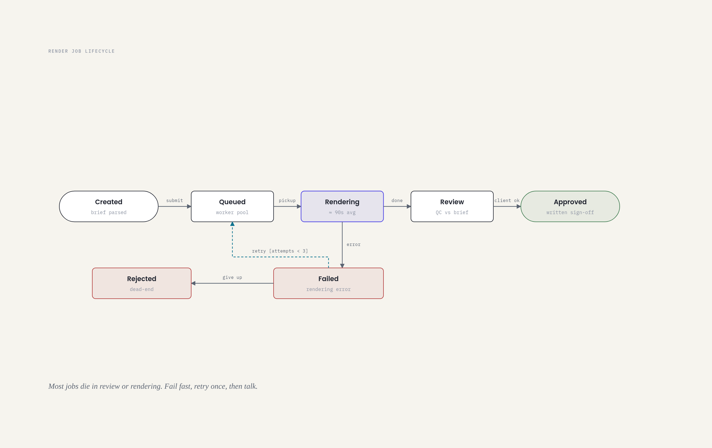 |
| [Loop](skills/ai-video-diagrams/assets/example-loop.html) | how the studio gets better | 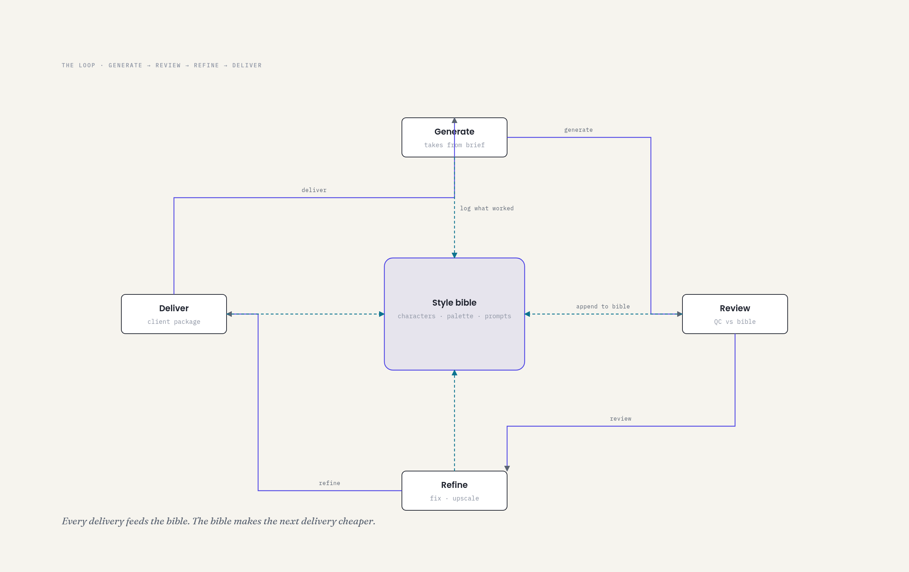 |
| [Architecture](skills/ai-video-diagrams/assets/example-architecture.html) | how the studio is wired | 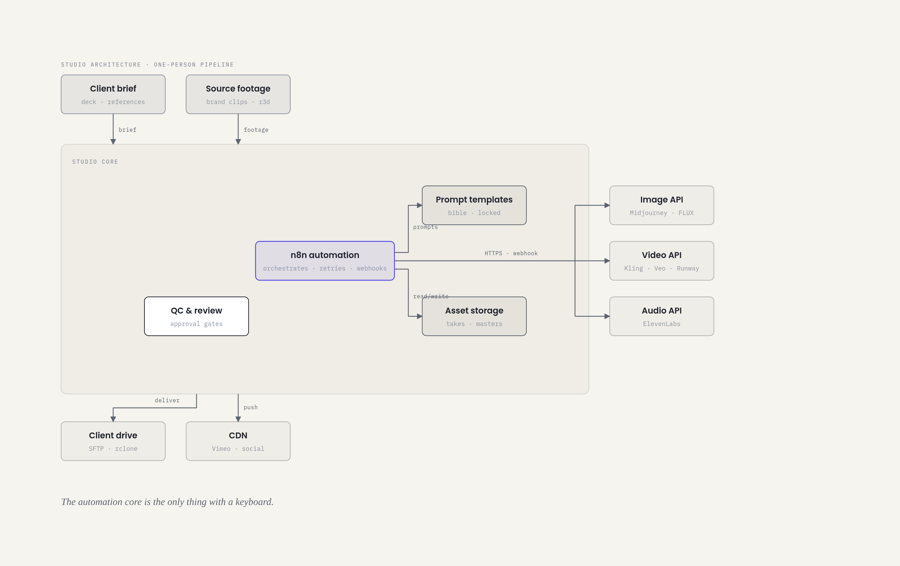 |
| [Timeline](skills/ai-video-diagrams/assets/example-timeline.html) | when things happen | 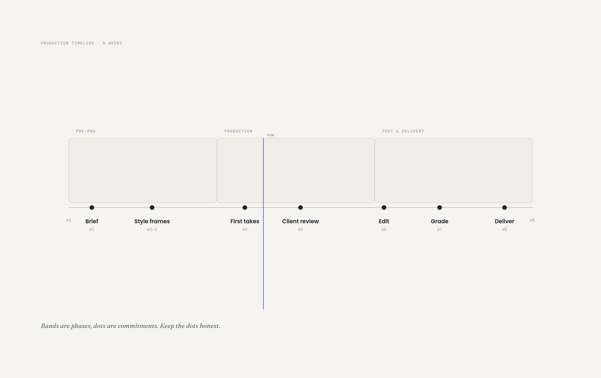 |
| [Tree](skills/ai-video-diagrams/assets/example-tree.html) | how the work decomposes | 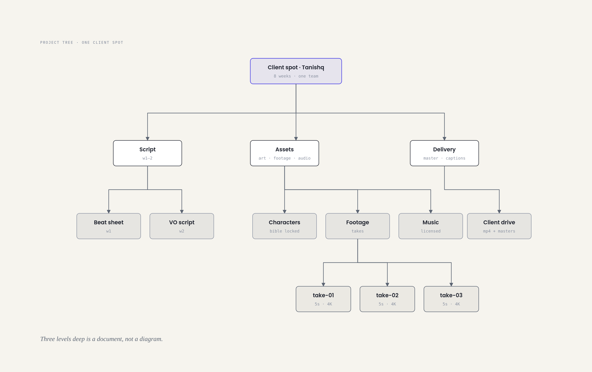 |
| [Funnel](skills/ai-video-diagrams/assets/example-funnel.html) | what survives the cut | 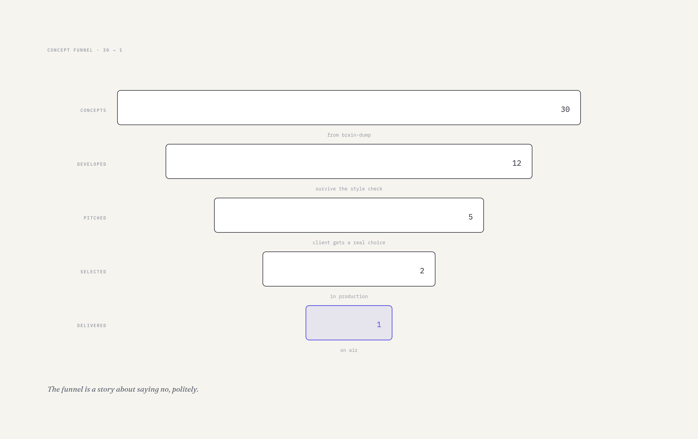 |

Every type ships in light and dark, generated from one source by
`scripts/skin.py`. The full gallery is [docs/gallery.html](docs/gallery.html)
and the editorial variant (header, diagram, stat cards) is
[example-pipeline-full.html](skills/ai-video-diagrams/assets/example-pipeline-full.html).

## The rules

The system is a few rules enforced everywhere, so nothing ever drifts.

1. **One design system.** Fraunces for display, Poppins for labels, IBM
   Plex Mono for data. Eleven colour tokens in `:root`. Radius 6 on
   nodes, 8 on containers. One arrowhead style. A pipeline and a
   character sheet share DNA.
2. **Typography does the work.** Label placement is a layout decision.
   If a label touches a line, the label moves.
3. **Density around 4/10.** Two arrows per relationship, one accent per
   diagram, dead space is load-bearing. A diagram that shows everything
   shows nothing.
4. **The focal node is chosen, not inherited.** Exactly one node per
   diagram gets the accent treatment: the thing the client must look at
   first. If you can't name it, the diagram isn't done. `commands/review.sh`
   checks this so a tired Friday brain can't skip it.

## How a diagram gets made

```
commands/pick.sh    "how the pipeline works"   → pipeline, copy example-pipeline.html
commands/make.sh    pipeline "client spot"     → scaffolds assets/<slug>.html from the template
# draw. read references/type-pipeline.md first. orthogonal connectors only.
python3 scripts/skin.py                        → generates the dark variant
bash scripts/screenshots.sh                    → rasterises PNGs with headless chromium
commands/review.sh                             → the gate: 1 focal node, aria-label, fresh dark
```

Then look at the PNG as a client would. The gate is the machine half of
the review; taste is the human half. Both pass before anything ships.

## Layout

```
skills/ai-video-diagrams/
  SKILL.md                  the whole system in one page
  references/               style-guide, onboarding, export + 14 type conventions
  assets/                   template + 14 hand-built examples, light and dark
  commands/                 pick · make · render · review
plugins/ai-video-diagrams/  Claude Code plugin manifest + slash commands
scripts/                    skin.py (dark generator) · screenshots.sh · gallery.py
docs/                       gallery + 28 PNGs
```

The `references/type-*.md` files are the interesting part. Each one
codifies a layout: where nodes go, how arrows bend, how many states a
state machine should have. They are what let me hand a blank template to
an automation and get something that looks designed.

## Copying the system

The whole thing is open under CC BY 4.0. To make it yours: change the
tokens in `:root`, re-run `scripts/skin.py`, and the entire system
follows. That is the point of the tokens.

Typefaces are loaded from the Google Fonts CDN, not redistributed; see
[THIRD_PARTY_LICENSES.md](THIRD_PARTY_LICENSES.md) for the OFL details.

## Journal

- 2026-08-12: [Every AI video delivery comes with a drawing](https://www.madebysaira.me/blog/ai-video-diagrams/)

---

Original content (c) madebysaira, CC BY 4.0. Diagrams were made to be
copied; the rules were made to be stolen. Steal both.